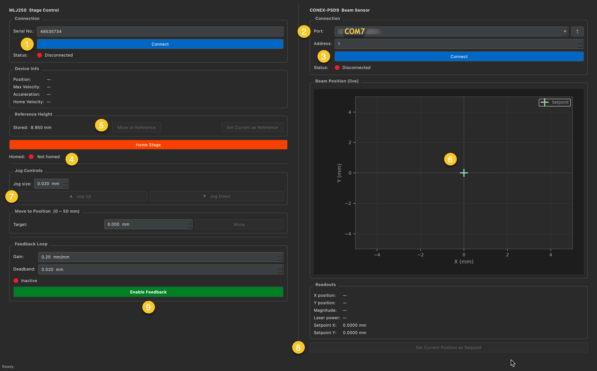
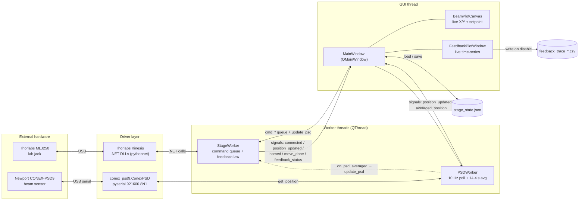
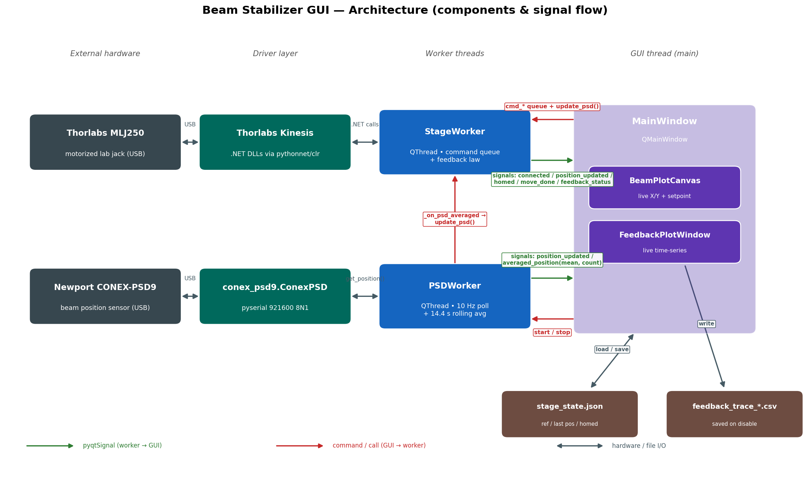

# Beam Stabilizer GUI

Feedback-controlled liquid-surface stabilization for the Yan Lab.

A PyQt5 desktop application that keeps a reflected laser beam locked onto a target position
by closing a feedback loop between a **Newport CONEX-PSD9** beam-position sensor
(it measures where the beam is) and a **Thorlabs MLJ250** motorized lab jack (it
moves to correct the beam). The left panel controls the stage; the right panel
reads the beam sensor.

---

## Overview

The beam sensor is polled at **10 Hz**. Each reading is added to a rolling
average over the last **14.4 s** (`PSD_AVG_N = 144` samples), and this smoothed
position is what the feedback loop acts on. Roughly once every **10 s**
(`FEEDBACK_HZ = 0.10`) the controller compares the averaged beam position to the
**setpoint** and, if the error is large enough, nudges the stage:

```
error      = || beam_avg − setpoint ||        (2-D magnitude)
stage_delta = gain · error · direction
new_target = clamp(current_position + stage_delta, 0 mm … 50 mm)
```

This is a proportional controller on the beam-to-setpoint distance. A
**deadband** suppresses small corrections, and the loop refuses to move while the
stage is still travelling or until the averaging window has filled.

When feedback is running, a live time-series window opens; when you disable
feedback, that trace is saved to a CSV (see [Files & data outputs](#files--data-outputs)).

---

## Hardware requirements

| Device | Role | Connection |
| --- | --- | --- |
| Thorlabs **MLJ250** motorized lab jack | Actuator (moves to stabilize the surface) | USB; identified by its **serial number** |
| Newport **CONEX-PSD9** | Beam-position sensor | USB serial — **921600 baud, 8N1**, controller **address 1–31** |
| Windows PC | Required for the Thorlabs **Kinesis** SDK (stage control) | — |

> The PSD sensor and the GUI itself are cross-platform. Stage control depends on
> the Windows-only Kinesis SDK (see the fallback note below).

---

## Software requirements & installation

1. Install **Python 3** (3.10+ recommended).
2. Install the Python dependencies:
   ```bash
   pip install -r requirements.txt
   ```
   This installs **PyQt5**, **pyserial**, **matplotlib**, and (on Windows)
   **pythonnet**. See [requirements.txt](requirements.txt).
3. Install the **Thorlabs Kinesis** SDK to its default location:
   ```
   C:\Program Files\Thorlabs\Kinesis\
   ```
   (this path is set in [mlj250_conex_gui.py](mlj250_conex_gui.py) near the top —
   edit it there if your install differs).

> **Graceful fallback:** if the Kinesis SDK is missing (e.g. on macOS/Linux or a
> PC without it), the app still launches and prints
> `[WARN] Thorlabs Kinesis not available: …`. The beam-sensor side works
> normally, but the **stage controls are disabled**. This is handy for testing
> the PSD readout without the stage attached.

---

## Running

From the project directory:

```bash
python mlj250_conex_gui.py
```

---

## Step-by-step operating guide

The numbered badges below correspond to the annotated screenshot:



### 1. Connect to the Stage
Enter the MLJ250 **serial number** in the *Serial No.* field and click
**Connect**. On success the status dot turns green and the *Device Info* panel
fills in (position, max velocity, acceleration, homing velocity). The app also
restores any saved reference height for that serial number.

> Notes: The default serial number is the serial number for the Yan lab stage.

### 2. Select the Beam Sensor Port
On the right panel, pick the CONEX-PSD9 **COM port** from the *Port* dropdown
(use the **↺** button to refresh the list) and set the controller **Address**
(default **1**).

> Notes: Currently, the Yan lab PSD9 sensor is connected to COM7.

### 3. Connect to the Beam Sensor
Click **Connect** under the *Port* selector. The status dot turns green, the live
**Beam Position** plot begins updating, and the *Readouts* (X, Y, magnitude,
laser power) start showing values.

### 4. Home the Stage
Click **Home Stage**. Homing establishes the stage's zero reference and is
**required before any motion** — jog, move-to-position, and the reference-height
buttons stay locked until the *Homed* indicator is green.

> Notes: The GUI will attempt to read the stage's home status. If the stage is
> already homed (since we never turn it off), the indicator is green, and all
> motion commands etc. are allowed.

### 5. Move to (gold) Reference Height
- **Move to Reference** drives the stage back to that stored height.
- **Set Current as Reference** stores the stage's current position as the
  reference height. It is saved per serial number in `stage_state.json`, so it
  is remembered between sessions.

> Notes: Default reference height is hard-coded in software to 8.950 mm, which 
> is the stage height for gold piece on a glass slide. In principle, other 
> heights can be set during experiments.

### 6. Beam Position Live View
The *Beam Position (live)* plot shows the recent beam trail in X/Y (mm) with the
**setpoint** marked as a crosshair. Use it together with the numeric *Readouts*
to confirm the beam is on the sensor and stable before enabling feedback.

> Notes: With the gold sample at the reference height, align the beam to the 
> center of the CONEX PSD9 sensor using the two routing mirrors after the dichroic 
> filter in front of the detection optics.

### 7. Jog Controls
Set a **Jog size** (mm) and use **▲ Jog Up** / **▼ Jog Down** to move the stage
by that increment for manual positioning of your sample (not gold).

> Notes: To find the height of your sample, you can start jogging up or down in
> 0.5 mm or 1 mm increments, until you start to hit the beam sensor. Then adjust
> jog step size to smaller increments and optimize beam position on the sensor.
> The sensor y-coordinate may be off-zero regardless of heigh, so trust the x-
> coordinate the most.

### 8. Set the Setpoint
Click **Set Current Position as Setpoint** to capture the current (averaged)
beam position as the target the feedback loop will hold. The *Setpoint X/Y*
readouts and the crosshair on the live plot update to match. **Set the setpoint
before enabling feedback** so the loop locks onto the position you want.

> Notes: To enable feedback control of (liquid) sample height, ensure that you
> are at the correct height. The setpoint is calculated from the previous 14.4s
> of (x,y) data, so make sure to let the sample sit at your preferred height 
> for some time before selecting the setpoint for the feedback control.

### 9. Feedback Loop
Set the **Gain** (mm of stage motion per mm of beam error) and the **Deadband**
(errors smaller than this are ignored), then click **Enable Feedback**. The
button turns red and reads *Disable Feedback* while active; most other controls
lock out to prevent interference. A live trace window opens. Click **Disable
Feedback** to stop and save the trace.

> Notes: It should not be necessary to change default values of deadband and 
> gain. If the feedback plot shows jittery/too rapid height adjustments that
> appear unfeasible, try increasing the deadband to 0.03 mm rather than 0.02 mm.
> Larger GAIN values make the stage move in larger increments
> Larger DEADBAND values make the stage tolerate larger height deviations before
> trying to correct the height.

---

## Architecture

The application runs **three threads**: the Qt **GUI thread** (`MainWindow`) plus
two background **`QThread` workers** so that slow hardware I/O never freezes the
UI.

- **`PSDWorker`** polls the CONEX-PSD9 at 10 Hz, maintains the 14.4 s rolling
  average, and emits both the live and averaged positions back to the GUI as
  Qt **signals**.
- **`StageWorker`** receives **commands** from the GUI through a thread-safe
  queue (`cmd_connect`, `cmd_home`, `cmd_jog`, `cmd_move_to`,
  `cmd_start_feedback`, `cmd_stop_feedback`), runs the feedback law, and reports
  back via signals.
- The GUI bridges the two: when a new **averaged** beam position arrives from
  `PSDWorker` (`_on_psd_averaged`), it forwards it to `StageWorker.update_psd()`,
  which is the input the feedback tick acts on.

Hardware access is isolated in the driver layer: `conex_psd9.ConexPSD` wraps the
serial protocol (via **pyserial**), and the Thorlabs **Kinesis .NET DLLs** are
loaded through **pythonnet/clr**.



A rendered version of the same diagram:



> Regenerate the image after editing the source with:
> `python3 make_architecture_diagram.py` (writes `architecture.png` and
> `architecture.svg`).

---

## Files & data outputs

| File | Purpose |
| --- | --- |
| [mlj250_conex_gui.py](mlj250_conex_gui.py) | Main application: GUI, worker threads, feedback loop |
| [conex_psd9.py](conex_psd9.py) | Serial driver for the CONEX-PSD9 beam sensor |
| [make_architecture_diagram.py](make_architecture_diagram.py) | Regenerates `architecture.png` / `.svg` |
| [requirements.txt](requirements.txt) | Python dependencies |
| `stage_state.json` | Auto-saved per-serial state: reference height, last position, homed flag (written next to the app) |
| `feedback_trace_*.csv` | Live-trace data (raw X, sliding-window X, stage position) saved when feedback is **disabled**; includes a metadata header (gain, deadband, setpoint, feedback rate) |

---

## Configuration constants

Tunable parameters are defined near the top of
[mlj250_conex_gui.py](mlj250_conex_gui.py):

| Constant | Default | Meaning |
| --- | --- | --- |
| `STAGE_MIN_MM` / `STAGE_MAX_MM` | `0.0` / `50.0` | Stage travel limits (mm) |
| `STAGE_POLL_S` | `0.25` | Stage position poll interval (s) |
| `FEEDBACK_HZ` | `0.10` | Feedback loop rate (≈ every 10 s) |
| `PSD_POLL_HZ` | `10.0` | Beam sensor poll rate (Hz) |
| `PSD_AVG_N` | `144` | Rolling-average window length (144 / 10 Hz = 14.4 s) |
| `TRAIL_LEN` | `100` | Number of beam positions shown in the live trail |
